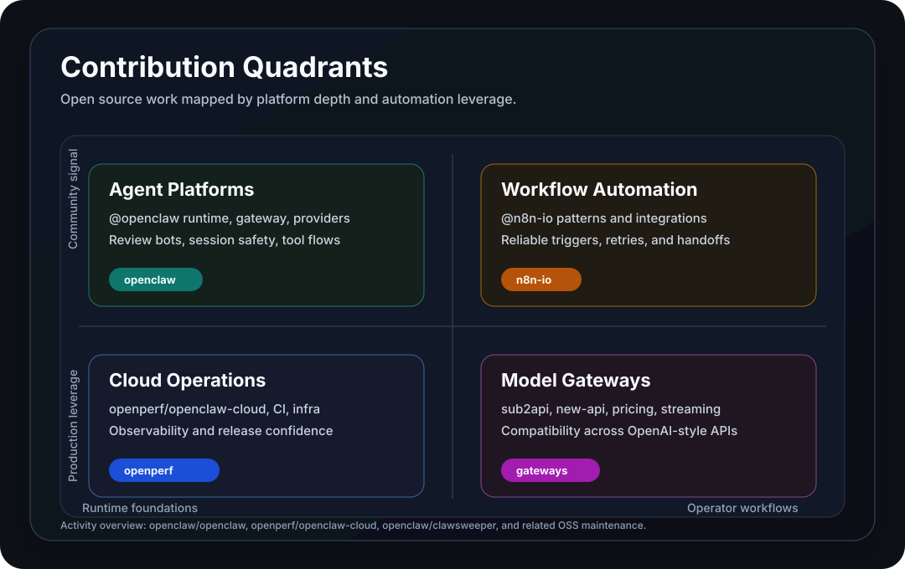

# Pluviobyte

## Activity overview

Contributed to [openclaw/openclaw](https://github.com/openclaw/openclaw), [openperf/openclaw-cloud](https://github.com/openperf/openclaw-cloud), [openclaw/clawsweeper](https://github.com/openclaw/clawsweeper) and 7 other repositories.

## Current focus

- [@openclaw](https://github.com/openclaw): agent runtime, provider reliability, gateway surfaces, and review automation.
- [@n8n-io](https://github.com/n8n-io): workflow automation patterns, integration design, and operator-facing reliability.
- Model gateways and pricing: focused fixes around routing, billing, streaming, and OpenAI-compatible surfaces.
- Developer tooling: CLI agents, desktop bridges, GitHub PR workflows, and regression-first maintenance.
