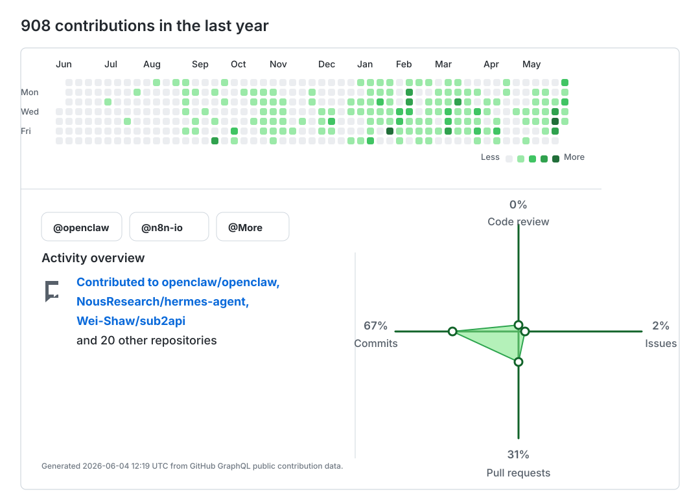

# Pluviobyte

Focused on agent platforms, workflow automation, model gateways, and reliability-first open source maintenance.

- [@openclaw](https://github.com/openclaw): agent runtime, provider reliability, gateway surfaces, and review automation.
- [@n8n-io](https://github.com/n8n-io): workflow automation patterns, integration design, and operator-facing reliability.
- Model gateways: routing, billing, streaming, and OpenAI-compatible API surfaces.
- Developer tooling: CLI agents, desktop bridges, GitHub PR workflows, and regression-first fixes.

## Projects & contributions

|  |  |
| --- | --- |
|  |  |
|  |  |
|  |  |
